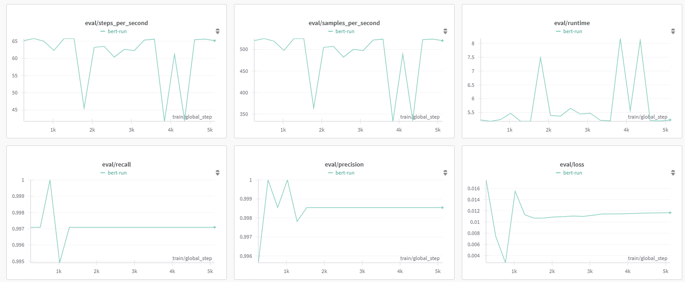

# Spam Classification

This repository contains the code of the **Spam classification model**.

## Technology stack
[](https://skillicons.dev)

## Model overview
Base model: **distilbert-base-uncased** ([link to the model](https://huggingface.co/distilbert/distilbert-base-uncased))
The model was *finetuned* on [spam-detection-dataset](https://huggingface.co/datasets/Deysi/spam-detection-dataset)


## Model results


- **Accuracy**: 0.999
- **Precision**: 0.998
- **Recall**: 1.0
- **F1-Score**: 0.999

## How to run
1. Install dependencies
```bash
pip install -r requirements.txt
```
2. Download the dataset
```bash
python data/download.py
```
3.Log into the **WandB**
```bash
wandb login
```
4. Run the training of the model
```bash
python src/train.py
```

## API

The api is developed with **FastAPI**

To run the api:

```bash
python api/app.py
```
